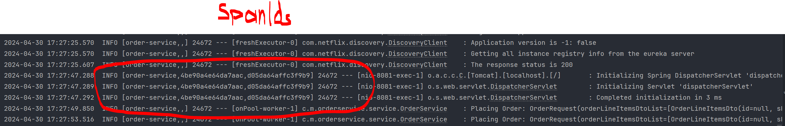

# spring-boot-microservices-old

This repository contains the latest source code of the spring-boot-microservices laboratory-work.

Zipkin can work with Spring Boot versions newer than 2.6.6, and
```xml
    <properties>
        <maven.compiler.source>17</maven.compiler.source>
        <maven.compiler.target>17</maven.compiler.target>
        <spring-cloud.version>2021.0.2</spring-cloud.version>
    </properties>
```

but it depends on the compatibility of the Spring Cloud
Sleuth and Spring Cloud Zipkin libraries you're using.

Spring Cloud Sleuth and Spring Cloud Zipkin are part of the Spring Cloud project, which releases versions designed
to work with specific versions of Spring Boot.

The forced choice of version 2.6.6 is determined by the choice of chain-compatible libraries for other-ordering
services and inventory-services in terms of `jakarta.persistence.*`, which requires 3.0.5, and `javax.persistence.*`,
which requires 2.6.6. This chain includes also `<dependency>` incompatibility:

```xml
<dependency>
    <groupId>mysql</groupId>
    <artifactId>mysql-connector-java</artifactId>
    <scope>runtime</scope>
</dependency>
```
with version 3.0.5 of <dependency> and
```xml
<dependency>
    <groupId>com.mysql</groupId>
    <artifactId>mysql-connector-j</artifactId>
    <scope>runtime</scope>
</dependency>
```
with version 2.6.6 respectively

The above reasons determined the use of a separate pair of databases, mysql order-service-old
and inventory-service-old. This was done in order to ensure that the Zipkin distributed tracing
system would work.

Zipkin run's in docker:
```hash
    docker run -d -p 9411:9411 openzipkin/zipkin
```

Java
If you have Java 17 or higher installed, the quickest way to get started is to fetch the latest release as a self-contained executable jar:

```hash
    curl -sSL https://zipkin.io/quickstart.sh | bash -s
    java -jar zipkin.jar
```





